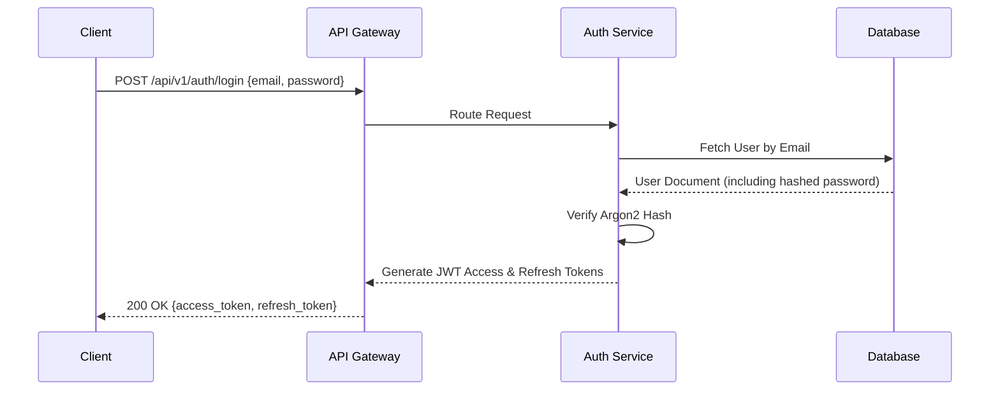

# API Integration Guide: Authentication Flow

This guide (How-To) explains how to authenticate with the KisanO Backend as a client application (Web or Mobile).

## The Flow



## Step 1: Login
Call `POST /api/v1/auth/login` with your credentials. You will receive an `access_token` and `refresh_token`.

## Step 2: Make Authenticated Requests
Attach the `access_token` to all subsequent requests via the Authorization header:
```
Authorization: Bearer <your_access_token>
```

## Step 3: Token Refresh
Access tokens expire after 15 minutes. When you receive a `401 Unauthorized` response, call `POST /api/v1/auth/refresh` with your `refresh_token` to receive a new access token without requiring the user to log in again.

For granular endpoint schemas (request bodies, exact response shapes), please refer to the live Swagger UI at `<backend_url>/docs`.
