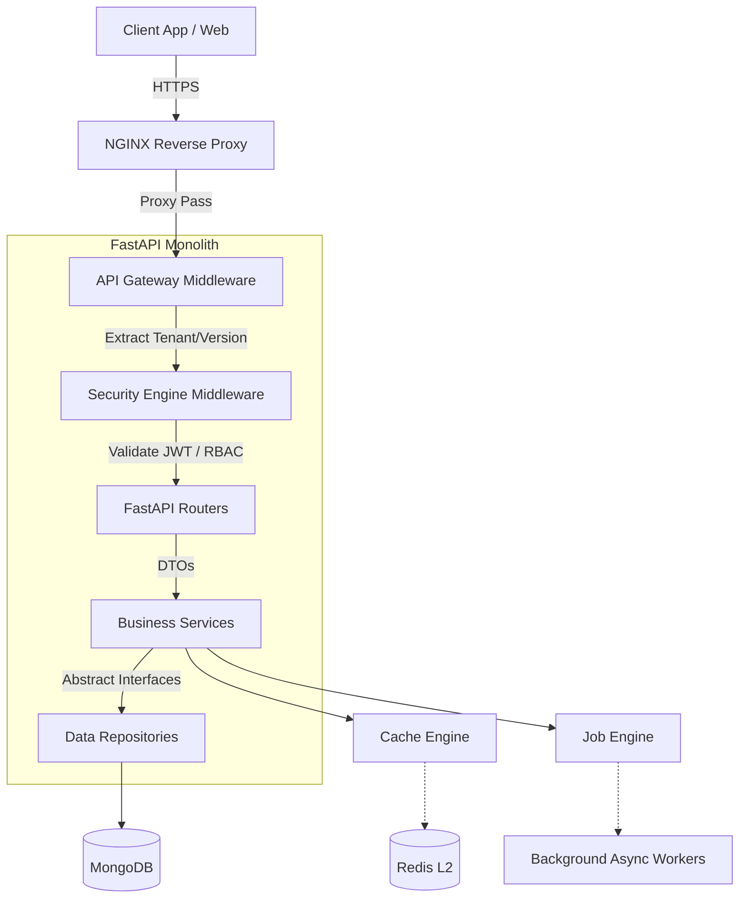

# System Overview

KisanO is built using an **Event-Driven, Clean Architecture** paradigm. The system is designed to gracefully evolve from a Monolith into Microservices.

## High-Level Architecture

The platform is strictly layered. Incoming HTTP requests pass through multiple defensive layers before ever hitting business logic.

## Core Principles

1. **Clean Architecture**: `Routers` depend on `Services`, which depend on `Repositories`. Inner layers (Services) never import from outer layers (Routers).
2. **Facade Pattern**: All platform utilities (Security, Gateway, Cache, Jobs) are hidden behind `Engine` classes. Business logic never imports `Redis` or `Passlib` directly.
3. **Zero-Trust**: The `SecurityEngine` validates every single request at the middleware boundary.
